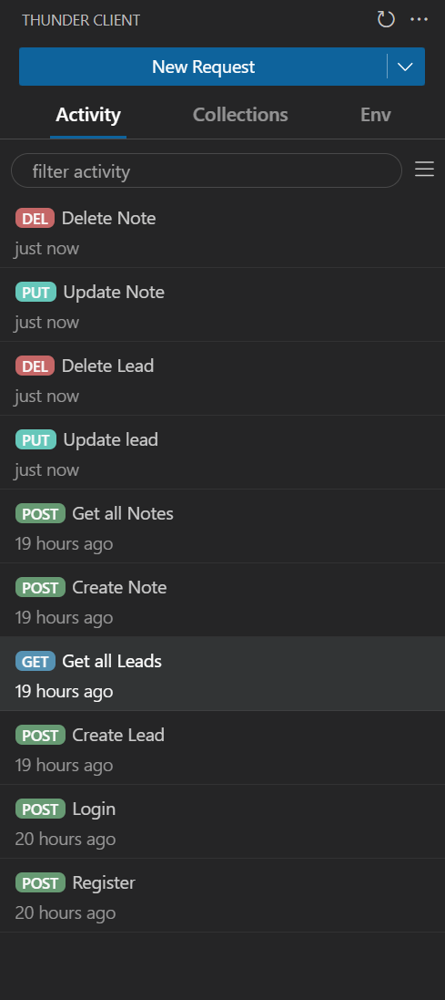

Here’s a concise backend README including the CRUD APIs:

---

# Leads Management Backend

Node.js + Express backend for managing leads and notes.

---

## Setup & Run

```bash
npm install
npm start
```

API runs on **[http://localhost:5000](http://localhost:5000)** by default.

---

## API Endpoints (CRUD)

### Auth

* **POST /auth/register** – Register user
* **POST /auth/login** – Login user

### Leads

* **GET /leads** – Get all leads
* **POST /leads** – Create a new lead
* **GET /leads/\:id** – Get lead by ID
* **PUT /leads/\:id** – Update lead
* **DELETE /leads/\:id** – Delete lead

### Notes

* **GET /leads/\:id/notes** – Get notes for a lead
* **POST /leads/\:id/notes** – Add note to a lead
* **PUT /leads/\:id/notes/\:noteId** – Update note
* **DELETE /leads/\:id/notes/\:noteId** – Delete 
note

---

## Folder Structure

```
src/
├─ controllers/   # Request handlers
├─models/         # DB models (e.g., Prisma)
├─ routes/        # API routes
├─ middleware/    # Auth & error handling
├─ utils/         # Helper functions
├─ app.js         # Express app
└─ server.js      # Server start
```

---
